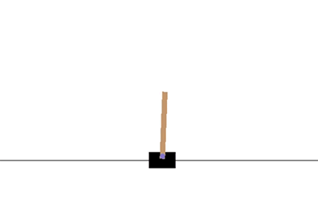
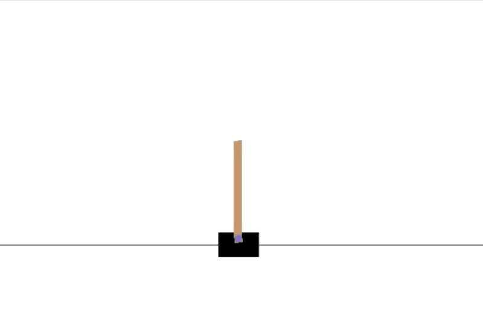

# torchagents
Implementations of RL algorithms using PyTorch.
* Deep Q-Learning
* Double Deep Q-Learning
* Deep Deterministic Policy Gradient
* Advantage Actor-Critic
* Proximal Policy Optimization

## [dqn] Deep Q-Learning 
[[Playing Atari with Deep Reinforcement Learning](https://www.cs.toronto.edu/~vmnih/docs/dqn.pdf)]  
Simple implementation of the deep Q-learning agent with experience replay and a target network that is periodically updated to match the value network.  
  

## [ddqn] Double Deep Q-Learning
[[Deep Reinforcement Learning with Double Q-learning](https://arxiv.org/abs/1509.06461)]  
Same as DQN, except the online network is used for action selection.  
  

## [ddpg] Deep Deterministic Policy Gradient
[[Continuous control with deep reinforcement learning](https://arxiv.org/abs/1509.02971)]  
Implementation of the deep deterministic policy gradient algorithm for continuous action spaces.  
  

## [a2c] Advantage Actor-Critic
[[Asynchronous Methods for Deep Reinforcement Learning](https://arxiv.org/abs/1602.01783v2)]  
Advantage actor-critic with eligibility traces. Value function trains towards λ-weighted sum of n-step TD-targets.  
  

## [ppo] Proximal Policy Optimization
[[Proximal Policy Optimization Algorithms](https://arxiv.org/abs/1707.06347)]  
Implementation of the clipping variant of PPO. Supports weight sharing between policy and value functions. Value function trains towards λ-weighted sum of n-step TD-targets. [Generalized advantage estimation](https://arxiv.org/abs/1506.02438) is used, truncated at end of episode or end of batch.  
  
